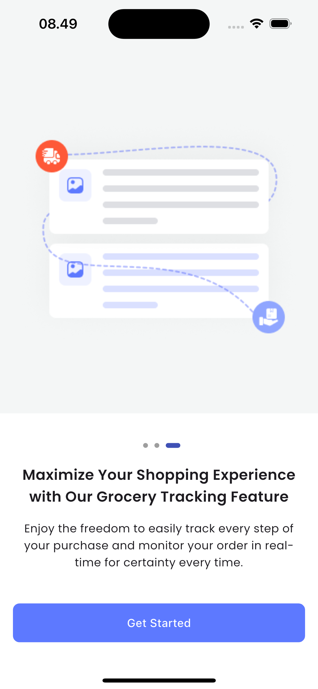
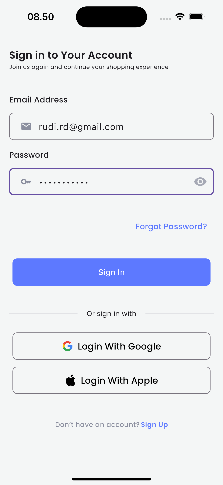
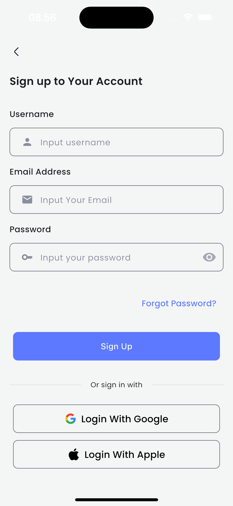
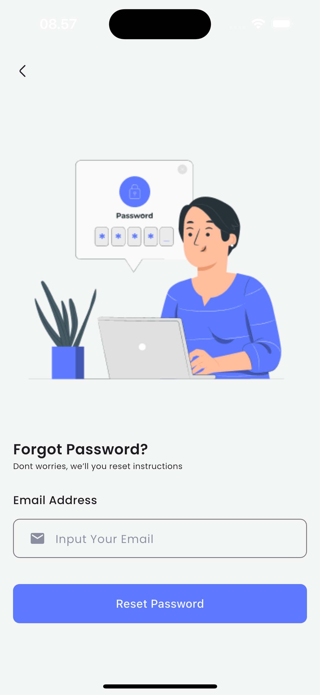

## Deskripsi
Shophub adalah aplikasi mobile e-commerce yang terinspirasi dari Shopee, dikembangkan menggunakan Flutter. Proyek ini bertujuan untuk menyediakan pengalaman belanja online yang modern, responsif, dan mudah digunakan, lengkap dengan fitur kategori, pencarian produk, notifikasi, dan UI yang menarik.

## Teknologi yang Digunakan
- **Flutter**: Framework utama untuk pengembangan aplikasi mobile multiplatform (Android, iOS, Web, Desktop).
- **Dart**: Bahasa pemrograman utama untuk Flutter.
- **Firebase**: Untuk autentikasi, database, dan notifikasi (jika diaktifkan).
- **Provider/ValueNotifier**: Untuk state management.
- **Iconsax**: Library ikon modern untuk tampilan UI.
- **sliding_up_panel**: Untuk panel interaktif di UI.
- **SVG & Asset Images**: Untuk ilustrasi dan ikon custom.

## Fitur Utama
- UI Shopee-like: Kategori, produk populer, search bar, notifikasi, dan card produk.
- Responsive Design: Tampilan menyesuaikan berbagai ukuran layar.
- State Management: Menggunakan ValueNotifier/Provider.
- Integrasi Firebase : Login, register, dan notifikasi.
- Sliding Up Panel: Panel interaktif untuk filter atau detail tambahan.

## Cara Menjalankan Proyek
1. Clone repository ini:
	```bash
	git clone https://github.com/rudi0085/shophub-project.git
	```
2. Buka folder project di VS Code atau IDE lain.
3. Jalankan perintah berikut untuk install dependencies:
	```bash
	flutter pub get
	```
4. Jalankan aplikasi:
	```bash
	flutter run
	```

## Kontribusi
Thanks for Afifhanifudin for this UI Design, so I can convert to Flutter UI Apps.
Silakan fork dan pull request jika ingin berkontribusi atau mengembangkan fitur baru.

## Screenshot UI
1. Onboarding Page, Login Page, Register Page, Forgot Password
()   

2. Main Page


## Kontak
Untuk pertanyaan atau kolaborasi, hubungi [rudi0085](https://github.com/rudi0085).
